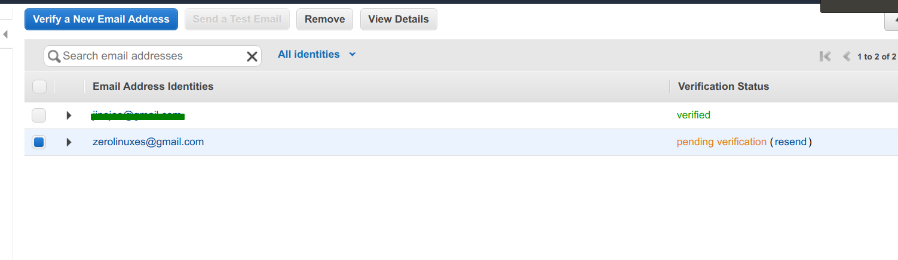
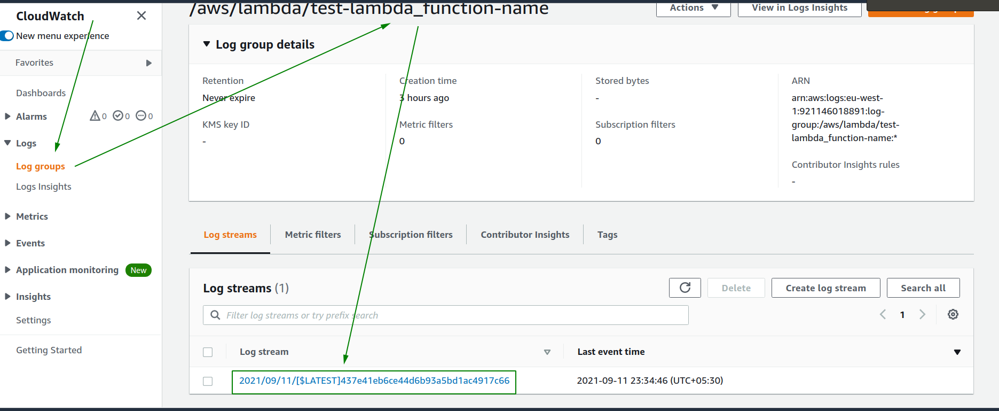
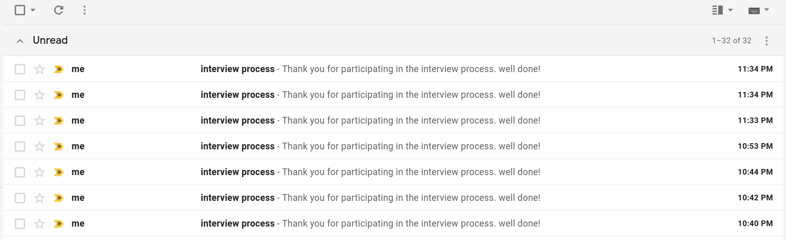

#### S3 trigger to lambda

##### Pre-req:

    1. terraform

##### aws resources:

    1. LAMBDA
    2. S3
    3. SES
    4. IAM

##### commands:

```bash

    1. terraform init
    2. terraform plan -var-file=config.tfvars
    3. terraform apply -var-file=config.tfvars

```
##### Please verify the ses email address 




##### Create the json file in the name of test.json and upload to s3 bucket.

```json

{
  "name1": ["jinojoe@gmail.com", 9894424448]
}

```

##### Lambda trigger the email to target email address




##### Mail Receipt

